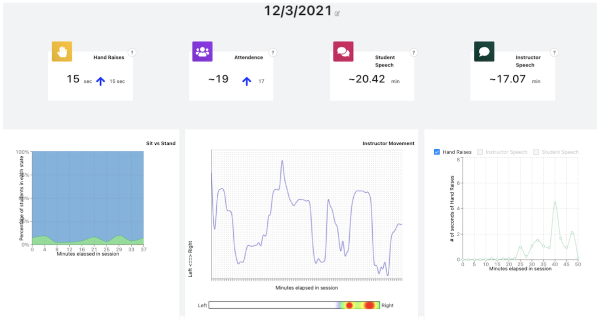

```{r setup, include=FALSE}
usethis::use_git_ignore(c("*.csv", "*.rds"))
options(htmltools.dir.version = FALSE)

library(knitr)
library(tidyverse)
library(xaringan)
library(fontawesome)
library(igraph)
library(tidygraph)
library(ggraph)
library(ggthemes)
library(cowplot)
library(kableExtra)
```

class: inverse, center, middle

# `r fa("far fa-images", fill = "#fff")`

**View the slides:** 

[bretsw.com/eme6356-su25-module3](https://bretsw.com/eme6356-su25-module3)

---

class: inverse, center, middle

# `r fa("thumbs-up", fill = "#fff")` <br><br> Looking Back at Module 2

---

# `r fa("thumbs-up", fill = "#fff")` Data Doubles

```{r, out.width = "640px", echo = FALSE, fig.align = "center"}
include_graphics("img/mirror.jpg")
```

--

- How well can data capture our multifaceted selves?

--

- Do data shape our identities?

---

# `r fa("thumbs-up", fill = "#fff")` `r fa("thumbs-down", fill = "#fff")` Double-Edged Sword

```{r, out.width = "600px", echo = FALSE, fig.align = "center"}

```

--

- How can data **help**? `r fa("thumbs-up", fill = "#782F40")` alerts and notifications

--

- How can data **hurt**? `r fa("thumbs-down", fill = "#782F40")` obsessive checking/tracking

---

# `r fa("thumbs-up", fill = "#fff")` What's the Point?

```{r, out.width = "600px", echo = FALSE, fig.align = "center"}

```

--

- What’s the purpose of knowing how many emails one sends? 

--

- What if parents showed data patterns to their kids? 

--

- Could performance analytics help people self-regulate? 

---

# `r fa("thumbs-down", fill = "#fff")` Cautions

```{r, out.width = "640px", echo = FALSE, fig.align = "center"}

```

--

- Who **owns** the data? The interpretation of the data?

--

- **Bias** exists in human interpretation and is baked into data analytics

---

class: inverse, center, middle

# `r fa("fas fa-question", fill = "#fff")` <br><br> Module 2 <br> Final Thoughts?

---

class: inverse, center, middle

# `r fa("fas fa-chart-line", fill = "#fff")` <br><br> Module 3: <br> Learning Analytics

---

class: inverse, center, middle

# `r fa("fas fa-chart-line", fill = "#fff")` <br><br> **Defining Analytics**

---

class: inverse, center, middle

# `r fa("fas fa-chart-line", fill = "#fff")` <br><br> **Defining Analytics**

**Measure `r fa("fas fa-arrow-right", fill = "#fff")` Collect `r fa("fas fa-arrow-right", fill = "#fff")` Analyze `r fa("fas fa-arrow-right", fill = "#fff")` Report**

---

class: inverse, center, middle

# `r fa("fas fa-chart-line", fill = "#fff")` <br><br> **Learning Analytics**

**(Performance at School)**

---

# `r fa("fas fa-chart-line", fill = "#fff")` Performance at School

```{r, out.width = "600px", echo = FALSE, fig.align = "center"}

```

Measure `r fa("fas fa-arrow-right", fill = "#782F40")` Collect `r fa("fas fa-arrow-right", fill = "#782F40")` Analyze `r fa("fas fa-arrow-right", fill = "#782F40")` Report

--

### `r fa("fas fa-question", fill = "#782F40")` **What might we measure?**

---

# `r fa("fas fa-chart-line", fill = "#fff")` Performance at School

```{r, out.width = "600px", echo = FALSE, fig.align = "center"}

```

- How did student learning changed when doing school from home, if at all?

--

- With whom do students interact in class discussions?

--

- From whom do teachers seek professional advice?


---

class: inverse, center, middle

# `r fa("fas fa-dice-one", fill = "#fff")` <br><br> **Learning Analytics** <br><br> Example 1

---

# `r fa("fas fa-dice-one", fill = "#fff")` Learning Analytics Example 1

**Online Class Discussions: Social Network Analysis**

--

```{r, out.width = "100%", echo = FALSE, fig.align = "center"}

```

--

### `r fa("fas fa-question", fill = "#782F40")` **What might we measure?**

---

# `r fa("fas fa-dice-one", fill = "#fff")` Learning Analytics Example 1

**Online Class Discussions: Social Network Analysis**

```{r, out.width = "100%", echo = FALSE, fig.align = "center"}

```

### `r fa("fas fa-shoe-prints", fill = "#782F40")` **Next step:** Look at the network by group or by week

---

# `r fa("fas fa-dice-one", fill = "#fff")` Learning Analytics Example 1

**Online Class Discussion - Social Network Analysis**

There are quite a few descriptive measures of networks:

--

- **Order:** number of nodes/vertices (students, in this case)

--

- **Size:** number of edges/connections (responses, in this case)

--

- **Reciprocity:** mutuality

--

- **Transitivity:** clustering

--

- **Diameter:** similar to degrees of separation

--

- **Density:** out of all possible connections, percentage that have been made

--

- **Node degree:** number of connections

--

- **Sentiment score:** how positive or negative in aggregate (see [**LIWC**](https://www.liwc.app/))

--

- Character count, Word count, Length of threads

---

class: inverse, center, middle

# `r fa("fas fa-dice-two", fill = "#fff")` <br><br> **Learning Analytics** <br><br> Example 2

---

# `r fa("fas fa-dice-two", fill = "#fff")` Learning Analytics Example 2

**Massive Online Open Course (MOOC) Discussion - Social Network Analysis**

```{r, out.width = "600px", echo = FALSE, fig.align = "center"}

```

**Article:** [A social network perspective on peer supported learning in MOOCs for educators ](http://www.irrodl.org/index.php/irrodl/article/view/1852) (Kellogg, Booth, & Oliver, 2014)

---

# `r fa("fas fa-dice-two", fill = "#fff")` Learning Analytics Example 2

**Massive Online Open Course (MOOC) Discussion - Social Network Analysis**

```{r, out.width = "600px", echo = FALSE, fig.align = "center"}

```

**Data source:** [Massively Open Online Course for Educators (MOOC-Ed) network dataset](https://dataverse.harvard.edu/dataset.xhtml;jsessionid=9ad052693563b29056a88d490182?persistentId=doi%3A10.7910%2FDVN%2FZZH3UB&version=&q=&fileTypeGroupFacet=&fileAccess=&fileSortField=name&fileSortOrder=desc)]

---

# `r fa("fas fa-dice-two", fill = "#fff")` Learning Analytics Example 2

**Massive Online Open Course (MOOC) Discussion - Social Network Analysis**

```{r, out.width = "100%", echo = FALSE, fig.align = "center"}

```

---

# `r fa("fas fa-dice-two", fill = "#fff")` Learning Analytics Example 2

**Massive Online Open Course (MOOC) Discussion - Social Network Analysis**

```{r, out.width = "100%", echo = FALSE, fig.align = "center"}

```

--

### `r fa("fas fa-shoe-prints", fill = "#782F40")` **Next step:** Infer network structure

---

# `r fa("fas fa-dice-two", fill = "#fff")` Learning Analytics Example 2

**Massive Online Open Course (MOOC) Discussion - Social Network Analysis**

```{r, out.width = "100%", echo = FALSE, fig.align = "center"}

```

(try using **[brms](https://paul-buerkner.github.io/brms/)**: An R package for Bayesian multilevel models using Stan)

---

class: inverse, center, middle

# `r fa("fas fa-dice-one", fill = "#fff")` `r fa("fas fa-dice-two", fill = "#fff")` <br><br> **Learning Analytics** <br><br> Comparing Examples 1 & 2

---

# `r fa("fas fa-dice-one", fill = "#fff")` `r fa("fas fa-dice-two", fill = "#fff")` Comparing Examples 1 & 2

```{r, out.width = "540px", echo = FALSE, fig.align = "center"}

```

---

# `r fa("fas fa-dice-one", fill = "#fff")` `r fa("fas fa-dice-two", fill = "#fff")` Comparing Examples 1 & 2

```{r, out.width = "100%", echo = FALSE, fig.align = "center"}

```


---

class: inverse, center, middle

# `r fa("fas fa-dice-three", fill = "#fff")` <br><br> **Learning Analytics** <br><br> Example 3

---

# `r fa("fas fa-dice-three", fill = "#fff")` Learning Analytics Example 3

<iframe frameborder="0" id="kaltura_player" src="https://cdnapisec.kaltura.com/p/1038472/sp/103847200/embedIframeJs/uiconf_id/46145191/partner_id/1038472?iframeembed=true&amp;playerId=kaltura_player&amp;entry_id=1_3b8ykrr9&amp;flashvars[streamerType]=auto&amp;flashvars[localizationCode]=en_US&amp;flashvars[leadWithHTML5]=true&amp;flashvars[sideBarContainer.plugin]=true&amp;flashvars[sideBarContainer.position]=left&amp;flashvars[sideBarContainer.clickToClose]=true&amp;flashvars[chapters.plugin]=true&amp;flashvars[chapters.layout]=vertical&amp;flashvars[chapters.thumbnailRotator]=false&amp;flashvars[streamSelector.plugin]=true&amp;flashvars[EmbedPlayer.SpinnerTarget]=videoHolder&amp;flashvars[dualScreen.plugin]=true&amp;flashvars[hotspots.plugin]=1&amp;flashvars[Kaltura.addCrossoriginToIframe]=true&amp;&amp;wid=1_vnbeixuu" title="Kaltura Player" width="720" height="480"></iframe>

See the [My Learning Analytics Canvas dashboard](https://its.umich.edu/academics-research/teaching-learning/my-learning-analytics) at University of Michigan


---

class: inverse, center, middle

# `r fa("fas fa-dice-four", fill = "#fff")` <br><br> **Learning Analytics** <br><br> Example 4

---

# `r fa("fas fa-dice-four", fill = "#fff")` Learning Analytics Example 4

```{r, out.width = "420px", echo = FALSE, fig.align = "center"}

```

From reading [3.3 Automated Classification of Elementary Instructional Activities: Analyzing the Consistency of Human Annotations (Foster et al., 2024)](https://learning-analytics.info/index.php/JLA/article/view/8323/7821)


---

class: inverse, center, middle

# `r fa("fas fa-dice-five", fill = "#fff")` <br><br> **Learning Analytics** <br><br> Example 5

---

# `r fa("fas fa-dice-five", fill = "#fff")` Learning Analytics Example 5

```{r, out.width = "100%", echo = FALSE, fig.align = "center"}

```

From reading [3.7 A Closer Look at Instructor Use and Sensemaking Processes of Analytics Dashboards: Past, Present, and Future (AlZoubi & Baran, 2024)](https://learning-analytics.info/index.php/JLA/article/view/8323/7821)


---

class: inverse, center, middle

# `r fa("fas fa-binoculars", fill = "#fff")` <br><br> Looking ahead

---

# `r fa("fas fa-calendar-day", fill = "#fff")` Semester schedule

```{r, out.width = "720px", echo = FALSE, fig.align = "center"}

```

- **Module 1:** Introduction to Analytics
- **Module 2:** Performance Analytics
- **Module 3: Learning Analytics**
- **Module 4:** Web Analytics
- **Module 5:** Data Visualization
- **Module 6:** Ethics in Learning Analytics
- **Module 7:** Future of Analytics
- **Module 8:** Case Discussions

---

# `r fa("fas fa-calendar-day", fill = "#fff")` Module structure

```{r, out.width = "480px", echo = FALSE, fig.align = "center"}

```

- `r fa("video", fill = "#782F40")` Watch

- `r fa("compass", fill = "#782F40")` Explore

- `r fa("book-open", fill = "#782F40")` Read

- `r fa("comments", fill = "#782F40")` Discuss

- `r fa("fas fa-keyboard", fill = "#782F40")` Create

---

# `r fa("fas fa-calendar-day", fill = "#fff")` Upcoming Assignments

```{r, out.width = "600px", echo = FALSE, fig.align = "center"}

```

--

### Discussion (50 points)

- Initial video/audio post on Canvas due by second Friday

- At least 3 responses due on Canvas by end of Module 3 (Sunday)

---

# `r fa("fas fa-calendar-day", fill = "#fff")` Upcoming Assignments (Team)

```{r, out.width = "360px", echo = FALSE, fig.align = "center"}

```

### Analytics Problem Plan (100 points) - **due end of Module 3**

- "Write a brief report (approximately 750-1000 words) identifying and describing a real-world problem that might be addressed via analytics."

- "The emphasis of this assignment is on the conceptualization of the problem and the clear identification of a possible data source."

- "Then briefly describe how analytics will be used to solve the problem" 

- "You will not need to collect actual data related to this problem, just plan for how it would be done."

---

class: inverse, center, middle

# `r fa("fas fa-question", fill = "#fff")` <br><br> Questions

<hr>

**What questions can I answer for you now?**

**How can I support you this week?**

<hr>

`r fa("envelope", fill = "#fff")` [bret.staudtwillet@fsu.edu](mailto:bret.staudtwillet@fsu.edu) | `r fa("globe", fill = "#fff")` [bretsw.com](https://bretsw.com) | `r fa("fab fa-github", fill = "#fff")` [GitHub](https://github.com/bretsw/)

---

class: inverse, center, middle

# Learn to Code

```{r, out.width = "320px", echo = FALSE, fig.align = "center"}
include_graphics("img/dsieur.jpg")
```

**https://datascienceineducation.com/**

---

class: inverse, center, middle

# `r fa("fas fa-otter", fill = "#fff")` <br><br> Play in the <br> [Analytics Sandbox](https://bretsw.com/sandbox)

`r fa("fab fa-github", fill = "#fff")` [GitHub repository for code and data](https://github.com/bretsw/sandbox)

`r fa("fas fa-cubes-stacked", fill = "#fff")` [Datasets for practice](https://bretsw.com/post/datasets/)
